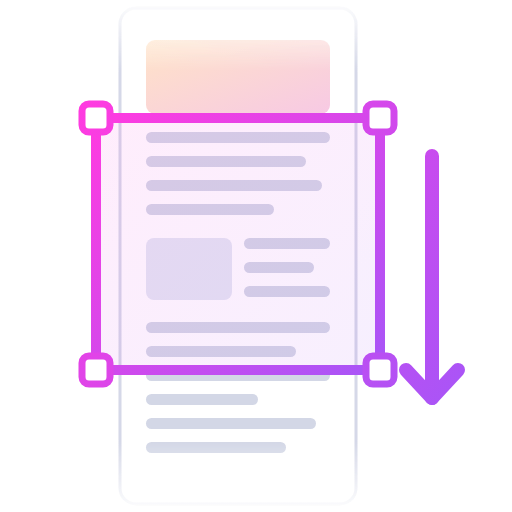
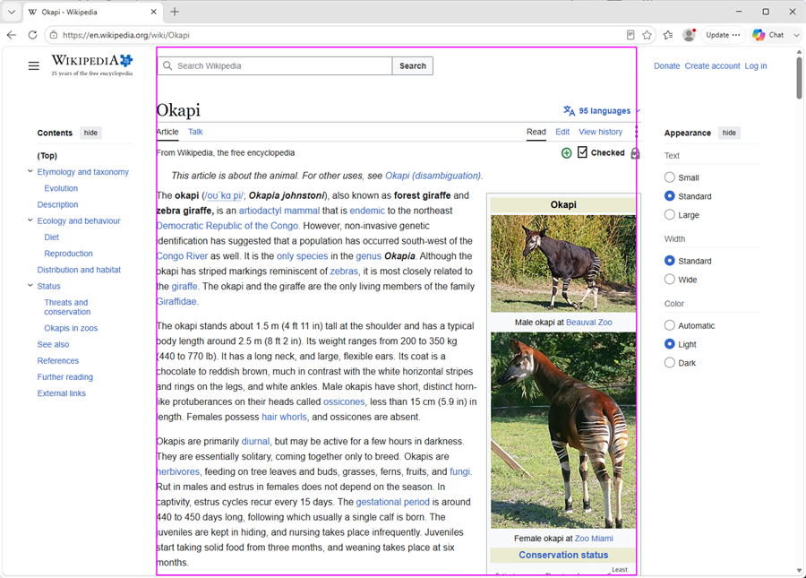
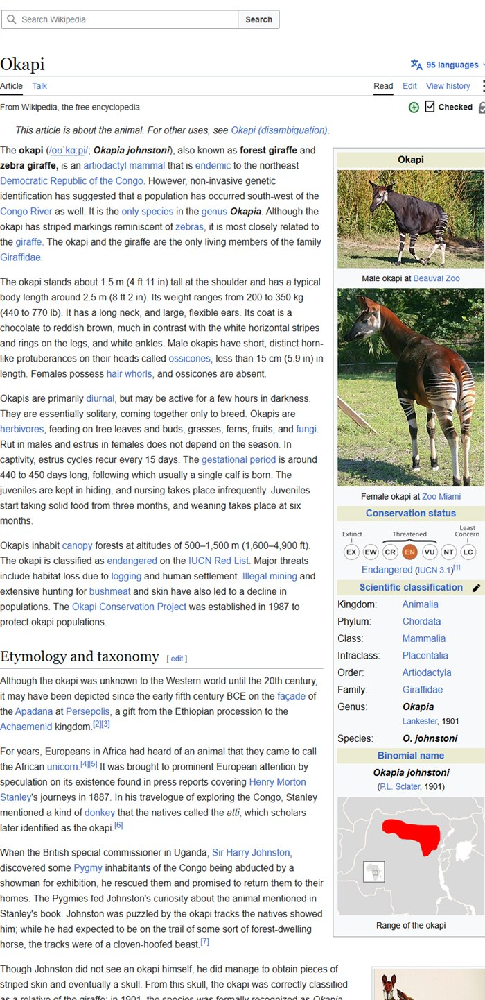

<div align="center">



# Longshot

**Full-page screenshots of one scrollable panel — in any app.**<br>
No browser extension. No DOM or accessibility APIs. Just pixels.

[](#-building)
[](#-building)
[](#-building)
[](#-building)
[](#)
[](LICENSE)
[](#-how-it-works-briefly)

</div>

Longshot takes a "full page" screenshot of one scrollable panel inside any
window — a browser tab's main article, a chat log, a code editor's file, a
PDF viewer — even when that panel is only one of *several* independently
scrollable regions on screen. You point it at the spot you want, it scrolls
that spot from top to bottom capturing frames along the way, then stitches
them into one continuous tall image.

It works against real applications, not just browsers, and it needs no
browser extension or app cooperation: it drives the mouse wheel and reads
the screen like a person would, so it captures whatever you can actually see.

|  | |
|---|---|
| 🎯 | **Finds the region for you** — hover anywhere; motion-diffing works out which rectangle actually scrolls |
| 🧩 | **Handles multi-pane UIs** — picks the one panel you pointed at, not the whole window |
| 🖼️ | **Seamless stitching** — cross-correlated overlap, sticky headers included once, not once per frame |
| 🔒 | **Never clicks or types** — scroll wheel and 4 navigation keys, nothing else |
| 🪟 | **Any app, not just browsers** — native windows, PDF viewers, editors |

Windows-only build for now (Linux/X11 and macOS backends are unimplemented;
`--backend x11` / `--backend macos` return a clean error rather than silently
doing nothing).

## 🤔 Why this exists

Browsers already ship a full-page screenshot tool, but it works by re-rendering
the page at a synthetic viewport the height of the whole document. That has
real consequences:

- **It re-lays-out the page.** Layout is redone at a synthetic viewport height,
  which re-triggers resize handlers, lazy-loading and intersection observers.
  Live application state — an open editor, a populated form, a preview you just
  generated — can shift or reset before the capture is taken.
- **It doesn't reliably capture `<canvas>` content.** Canvas and WebGL surfaces
  typically draw only what fits the visible viewport. Re-rendering tall doesn't
  redraw them to match, so they come out blank, clipped, or stale.
- **It only knows about the page.** A scrollable panel inside an app, a native
  desktop window, a PDF viewer — none of that is reachable.

Longshot sidesteps all of it by never touching the document: it scrolls the
real UI a notch at a time and reads real pixels off the screen. Whatever is
actually rendered in front of you is what lands in the image, application state
intact.

## 📸 Example

Capturing the article column of a Wikipedia page. Wikipedia has *three*
independently scrollable columns — the Contents tree on the left, the article
in the middle, the Appearance panel on the right — so it's a good test of
picking out the right one.

```
longshot capture --anchor 900,600 --out okapi.png
```

Longshot sends a few scroll notches at that point, diffs the before/after
screenshots, and outlines the region of pixels that actually moved. It writes
this confirmation image (`okapi-probe.bmp`) so you can see what it locked onto
before it captures anything:



Note the outline hugs the article column exactly — both sidebars and all the
browser chrome are correctly excluded, with no configuration and no knowledge
of Wikipedia's markup.

Then it scrolls that region to the top, walks it to the bottom, and stitches
the frames:

```
detected scrollable region: 476,200 826x908
captured 37 frames -> stitched 826x11013, wrote okapi.png
```

The viewport was 908px tall; the finished image is 11013px — **37 frames, about
12 screens' worth, in one seamless image.** Here's the top of it, spanning
roughly two screens with no seam where the frames were joined:



→ [**The complete 826×11013 strip**](docs/images/stitched-full-page.jpg) (scaled
down; it's too tall to show inline at readable size).

## ⚙️ How it works, briefly

Longshot doesn't read the target application's DOM or accessibility tree —
that would mean a different integration for every browser and every native
app. Instead:

1. **Find the region.** You hover the mouse over the scrollable area you want.
   Longshot sends a few scroll-wheel notches at that point and diffs the
   before/after screenshots to see exactly which rectangle of pixels actually
   moved — that's the region, regardless of what app owns it or what else is
   on screen.
2. **Scroll and capture.** It scrolls that region to the top, then walks it
   down to the bottom one step at a time, taking a screenshot at each step.
3. **Stitch.** Consecutive screenshots overlap (each scroll step moves less
   than a full screen), so Longshot cross-correlates each pair to find exactly
   how many new pixel-rows appeared, and concatenates only the new part. Sticky
   headers/footers that don't scroll are detected and included once, not once
   per frame.

The only things Longshot ever sends to the target application are scroll-wheel
notches and the four navigation keys (Page Up/Down, Home, End) — never a click,
never typed text — so it can't accidentally follow a link or submit a form
while it's driving the page.

## 🔨 Building

Requires CMake >= 3.20 and a C++17 compiler (MSVC / VS2022 Build Tools on
Windows).

```
cmake -S . -B build -DCMAKE_BUILD_TYPE=RelWithDebInfo
cmake --build build --config RelWithDebInfo
ctest --test-dir build -C RelWithDebInfo --output-on-failure
```

## 🚀 Usage

### Interactive (default)

```
longshot capture --out page.png
```

Hover the mouse over the scrollable region you want, press ENTER in the
terminal, confirm the detected region (a `<out>-probe.bmp` outline image is
written for reference), and the tool scrolls to the top, then to the bottom,
capturing and stitching as it goes.

### Skipping the hover prompt

Pass the anchor point directly and it probes there without waiting:

```
longshot capture --anchor 900,600 --yes --out page.png
```

### Non-interactive

```
longshot capture --region X,Y,W,H --window-id N --yes --out page.png
```

`--window-id` comes from `longshot list`. Skips the hover/confirm prompts and
the motion-diff probe entirely.

### Other commands

- `longshot list [--backend KIND] [--json]` — enumerate windows visible to a backend.
- `longshot stitch --frames DIR --out PATH` — stitch a directory of `frame_*.bmp`
  files (e.g. produced by `--keep-frames`) without touching the screen.
- `longshot doctor` — checks backend init, permissions, and does a live test
  capture; exit 0 only if a real capture would work.

### Capture flags

| Flag | Meaning |
|---|---|
| `--anchor X,Y` | Use this point instead of hovering interactively |
| `--region X,Y,W,H` | Skip detection entirely; capture exactly this rect |
| `--window-id N` | Window to activate/scroll (from `longshot list`) |
| `--inset L,T,R,B` | Shrink the (detected or explicit) region on each side |
| `--no-probe` | Skip the motion-diff probe (requires `--region`) |
| `--no-scroll-to-top` | Capture from the current scroll position, don't rewind |
| `--keep-frames DIR` | Save every captured `frame_NNN.bmp` for later `longshot stitch` |
| `--max-height N` | Cap the stitched output height (default 30000px) |
| `--yes` | Skip the confirmation prompt |
| `-v` / `-q` | Verbose / quiet logging |

Very long pages can exceed the default height cap — Longshot stops with a clear
error rather than writing a truncated image, so raise `--max-height` when you
mean to capture something enormous.

## 🔐 Permissions

Windows: none required for a normal desktop session. Input injection into an
**elevated** target window from a non-elevated Longshot process fails silently
(Windows UIPI) — `longshot doctor` warns about this when Longshot itself isn't
running elevated.

Capture needs an unlocked, active desktop session: with the workstation locked
there are no real pixels to read, and Longshot reports a capture failure rather
than writing a blank image.

## ⚠️ Known limitations

- One region per run — to capture a sidebar and main content separately, run
  the tool twice.
- **The region must not already be scrolled to the bottom when you start.**
  Detection works by scrolling *down* and looking for movement, so at the very
  bottom there is nothing left to move and you get "No scrollable region
  detected" even though the pointer is over a perfectly good scroller. This
  bites most often when re-running the tool, since a finished capture leaves
  the page at the bottom. Scroll up a little and run it again.
- Vertical scrolling only.
- The detected region may include the target's own scrollbar strip; trim it
  with `--inset` (e.g. `--inset 0,0,20,0`) if you don't want it.
- The target window must be on-screen and unobstructed; occluded, minimized,
  or off-virtual-desktop windows are not captured (composited-desktop capture
  only, no per-window capture API).
- Continuously animating content (video, carousels, live tickers) will not
  settle cleanly; the tool warns and continues with a possibly seamed result.
- Never clicks or types into the target window (see "How it works" above).
- Linux (X11) and macOS backends are not yet implemented.

## 📄 License

[MIT](LICENSE) © boroppi

Vendored third-party code: [`stb_image_write`](third_party/stb) by Sean Barrett,
released as public domain / MIT — compatible with the above.
